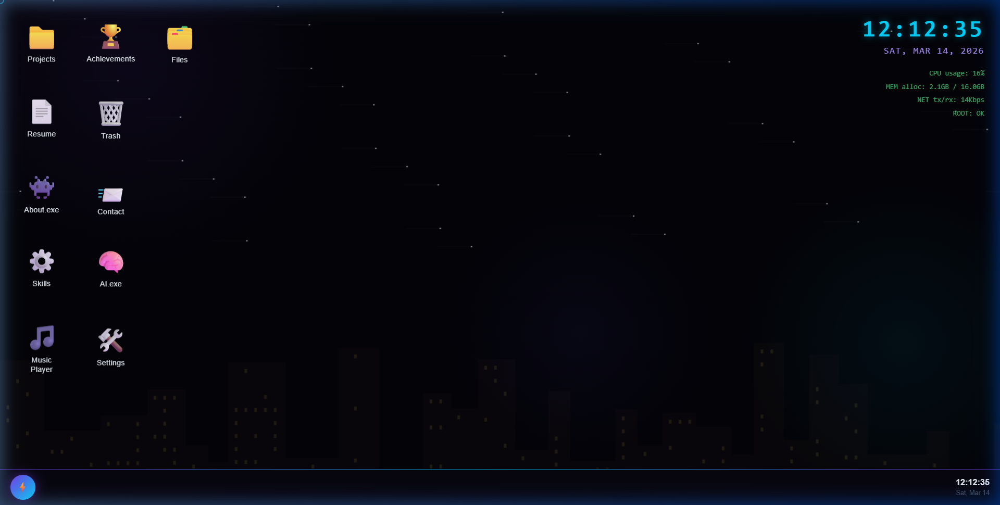
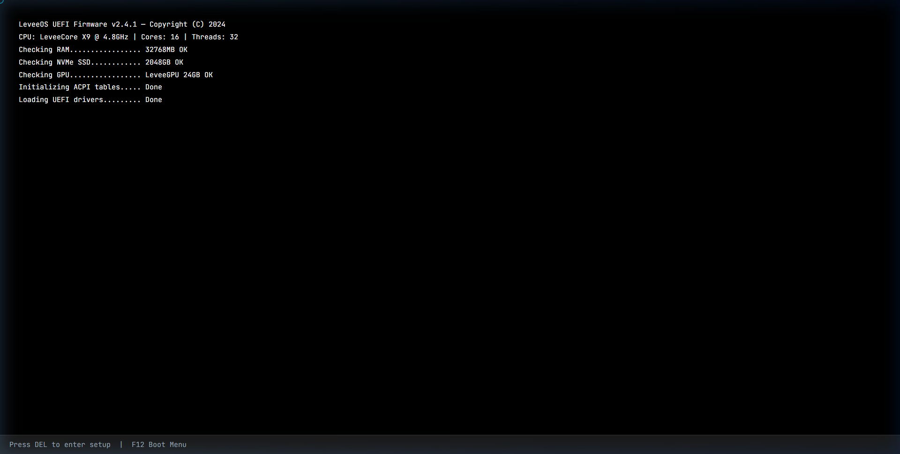
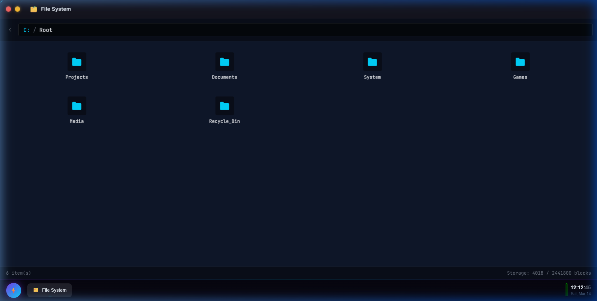
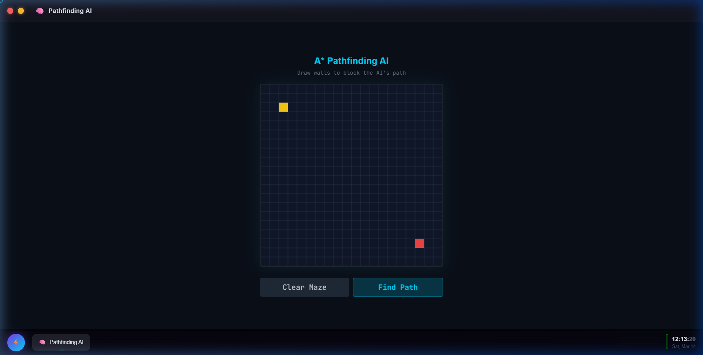
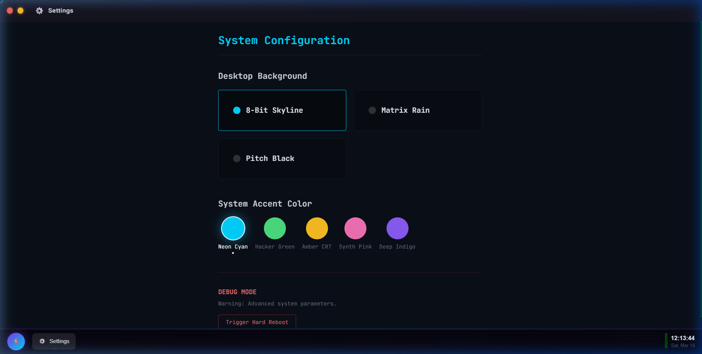
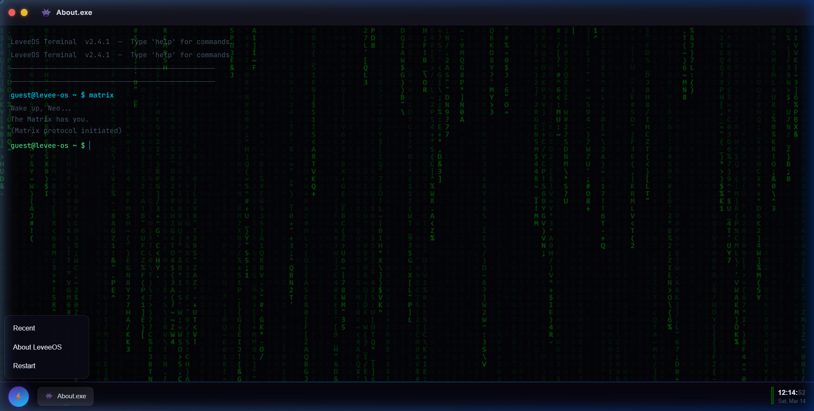

<h1 align="center">
   
  LeveeOS
   
</h1>

<h4 align="center">A highly immersive, interactive "Hacker/Cyberpunk OS" portfolio built with React and Framer Motion.</h4>

  
  
  

 

  

## 🚀 Features

LeveeOS doesn't just show a list of projects; it simulates a fully-fledged operating system in the browser to create a memorable and engaging experience.

- **UEFI Boot Sequence:** A multi-phase, cinematic BIOS boot screen featuring diagnostic checks, ASCII glitch art, memory verification logs, and a hyper-zoom entry directly into the desktop.
- **Interactive Window Manager:** A custom desktop environment complete with draggable, snappable, and minimizable windows, alongside a reactive taskbar.
- **Audio-Reactive Wallpapers:** 
  - **Matrix Rain:** Drops of digital code fall over the desktop. When the built-in Music Player hits heavy bass drops, the font sizes pulse and the text flashes white!
  - **Pitch Black:** A minimalist, distraction-free void that subtly pulses grey/white radial flashes synced perfectly to the beat.
  - **8-Bit Skyline:** A fully animated canvas skyline that acts as an FFT visualizer.
- **A* Pathfinding AI Visualizer:** Click the `AI.exe` minigame to draw blockading walls on a grid and watch the algorithm hunt for the shortest path in real-time.
- **Hacker HUD Widgets:** Real-time digital clock, date, and mocked system performance stats (Memory, CPU) constantly overlaid onto the desktop.
- **Terminal Easter Eggs:** Open `About.exe` and type secret commands like `matrix`, `weather`, or `sudo rm -rf`.
- **Global Theme Context:** Change the overarching OS accent colors (Neon Cyan, Hacker Green, Amber CRT, Synth Pink) from the native Settings App.
- **Fully Working File Explorer:** Navigate virtual paths (like `C:\Root\Games`) and trigger applications to launch by double-clicking file icons.

## 📸 Screenshots

  
  

  
  

  

## 🌐 Live Website

Check out the live interactive OS here: **https://website-leevee-os.vercel.app/**
